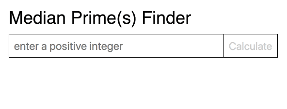

# prime-median

### Description

Finds the median(s) of a set of primes under some value n. Uses the Sieve of Eratosthenes algorithm. Was an excercise for a coding interview.

Contains a front-end client written in React which interacts with a back-end server written in Express.

### Installation

1. install `node` and `npm`
2. checkout this repo and `cd` into the directory
3. `npm install && cd client && npm install`

### Running

4. `npm run dev`